# Learn more about me 😎: [My Profile](https://github.com/AndEraneQ)

## About the project 😊:
This project was an assignment for the JIPP (Introduction to Programming) course in the third semester of studies.
It presents the functionality of a simple diary with features for adding and removing grades and behavior as well as calculating the average of grades.  

## 💻 Tech Stack:
    

## 🤴 Project requirements: 
Understanding the majority of basic structures in C++, such as constructors, inheritance, and polymorphism, as well as creating a binary database in this project.  

## How it works 🤪?
First of all you can start applicaiton on 2 ways, with command line parameter '0' and without parameters. Without parameter application will start and you will see main window.  
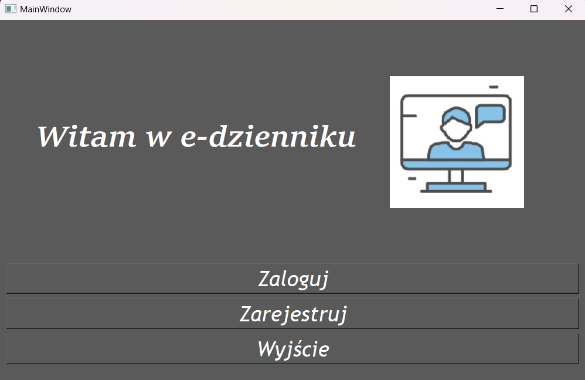  
###If u start with '0' it will return list of all users.  
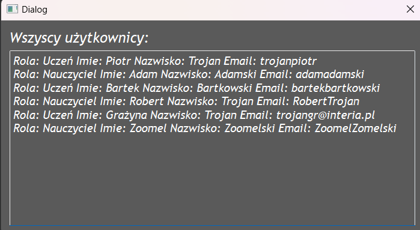  
###You can register here:  
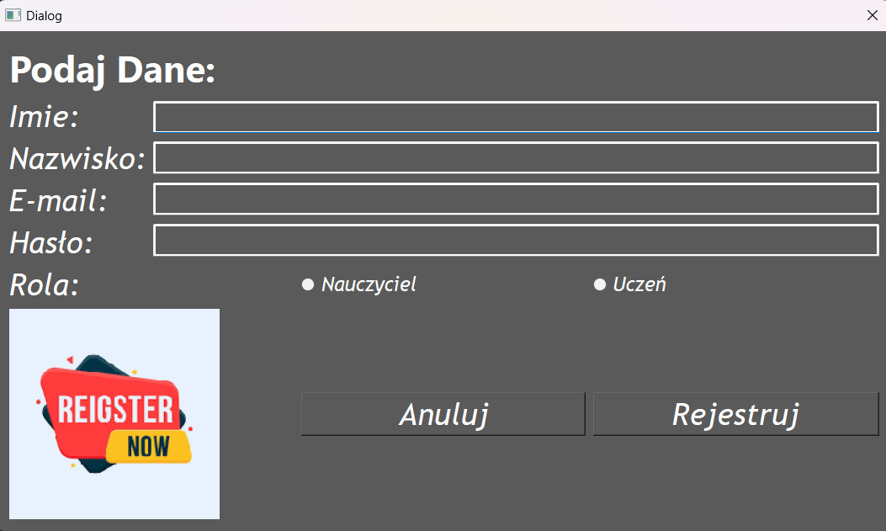  
###You can login here:  
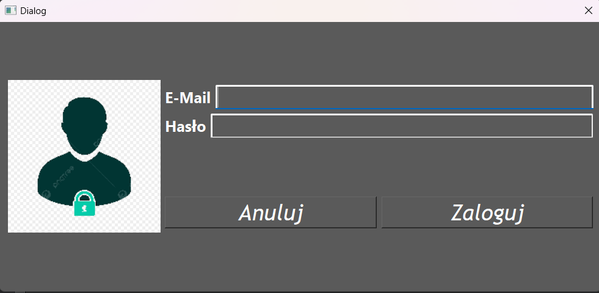  
You can login as a teacher or as a student. Here is teacher window.  
  
Next you have 4 options here:  
1 - Add Grade  
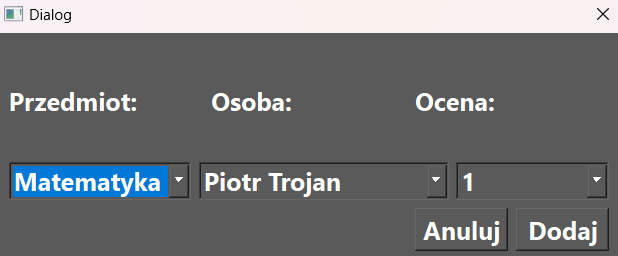  
2 - Add Behavior  
  
3 - Show Student Data  
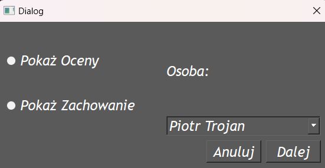  
If you choose student to show his data you can mark if u want see grades or behavior.  
- Behavior Window:  
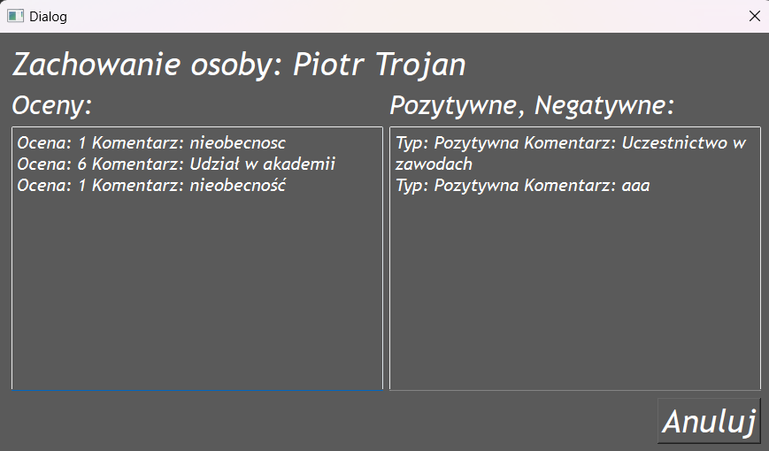  
- Grades Window:  
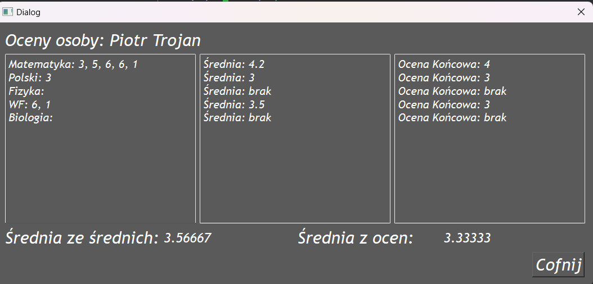  
4 - Delete Student Data  
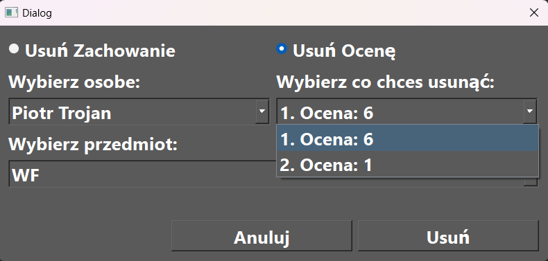  
If u login as a student you will get that window:  
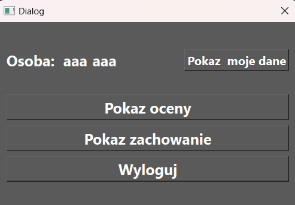  
If u want check grades or behavior it will automaticly open correct side for your data.  
You can also check your data in this app  
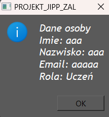  
