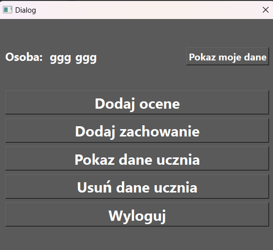
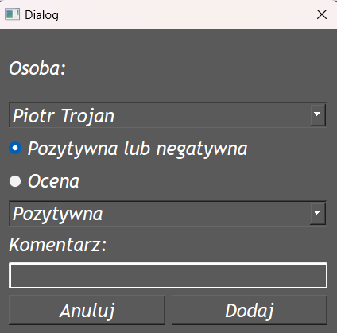

# Learn more about me 😎: [My Profile](https://github.com/AndEraneQ)

## About the project 😊:
### This project was an assignment for the JIPP (Introduction to Programming) course in the third semester of studies. It presents the functionality of a simple diary with features for adding and removing grades and behaviors, as well as calculating the average of grades.  

## 💻 Tech Stack:
 

## 🤴 Project requirements: 
### Understanding the majority of basic structures in C++, such as constructors, inheritance, and polymorphism, as well as creating a binary database in this project.  

## How it works 🤪?
### First of all, you can start the application in two ways: with the command line parameter '0' and without parameters. Without a parameter, the application will start and you will see the main window.  
   
### If you start with '0', it will return a list of all users.  
   
### You can register here:  
   
### You can log in here:  
   
### You can log in as a teacher or as a student. Here is the teacher window.  
   
### Next, you have four options here:   
### 1 - Add Grade  
   
### 2 - Add Behavior  
   
### 3 - Show Student Data  
   
### If you choose a student to show his data, you can mark if you want to see grades or behavior.  
### - Behavior Window:  
   
### - Grades Window:  
  
### 4 - Delete Student Data  
   
### If you log in as a student, you will get that window:  
   
### If you want to check grades or behavior, it will automatically open the correct side for your data.  
### You can also check your data by clicking the button in the top right corner.  
  

## Sum up 🤗
###  By creating a simple diary application with features such as grade management and behavior tracking, it provides hands-on experience in programming fundamentals. The project not only demonstrates technical skills but also emphasizes the importance of proper program structure and user interaction in software development.  
## Thanks for watching 😜
